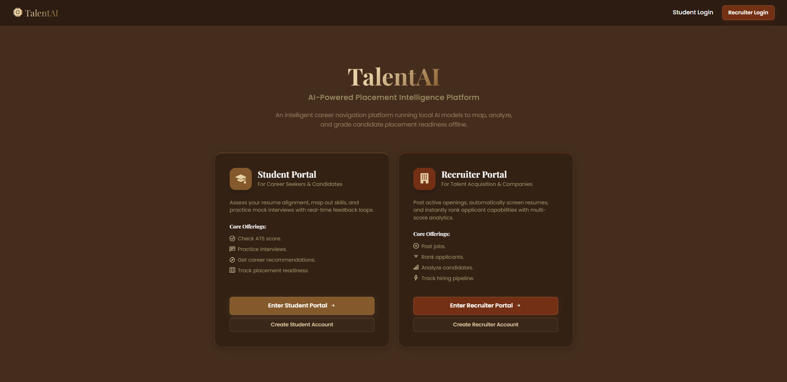
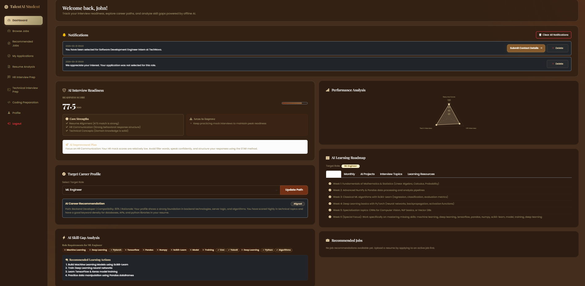
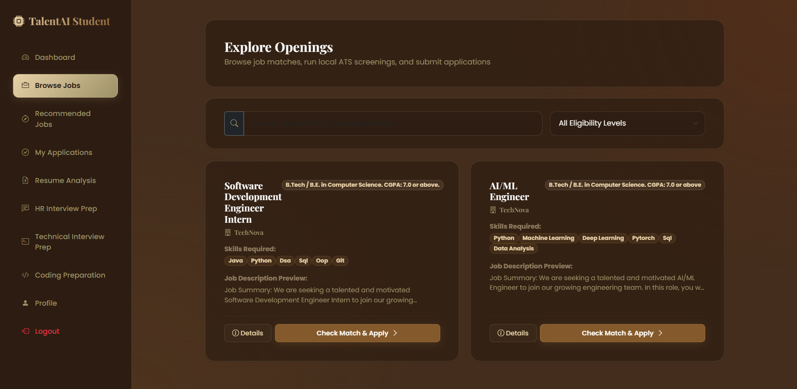
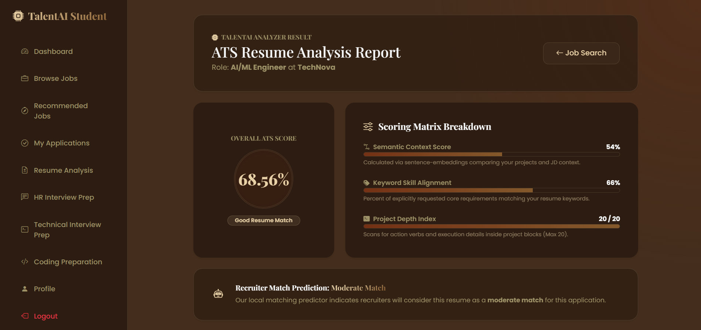
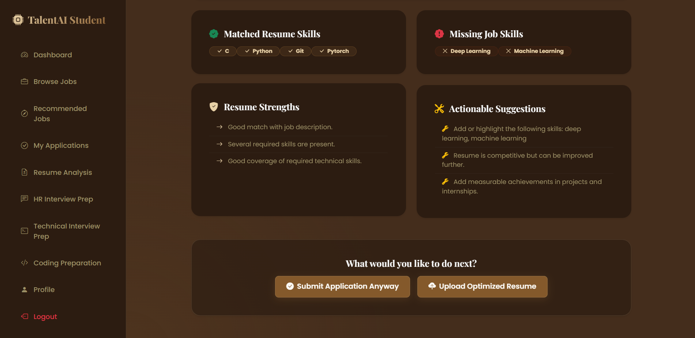
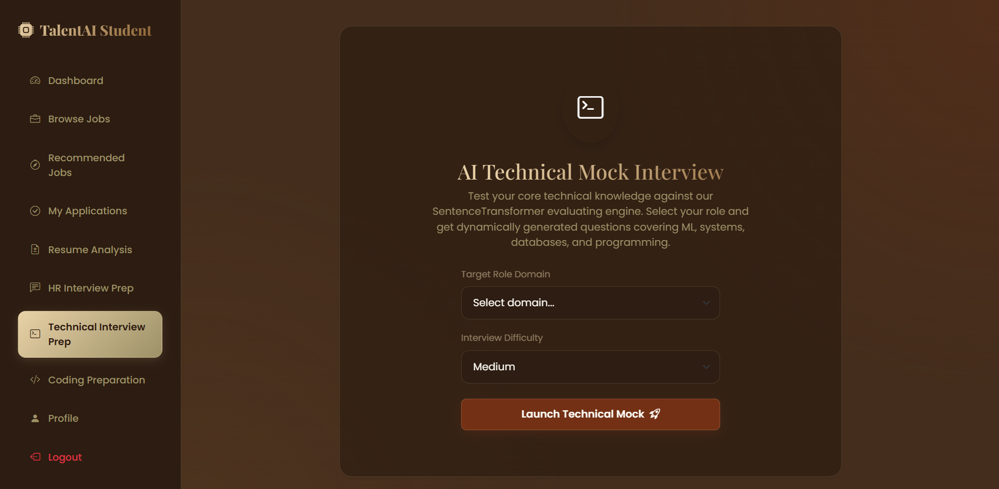
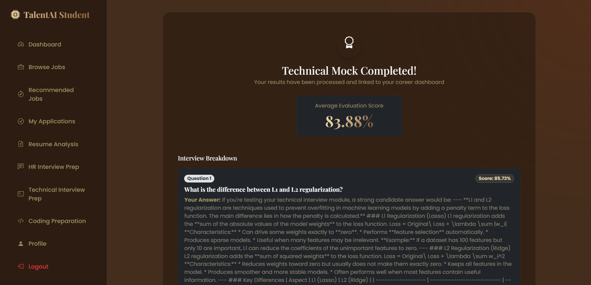
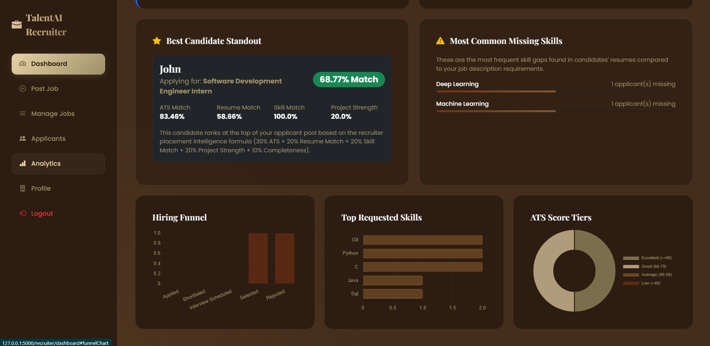
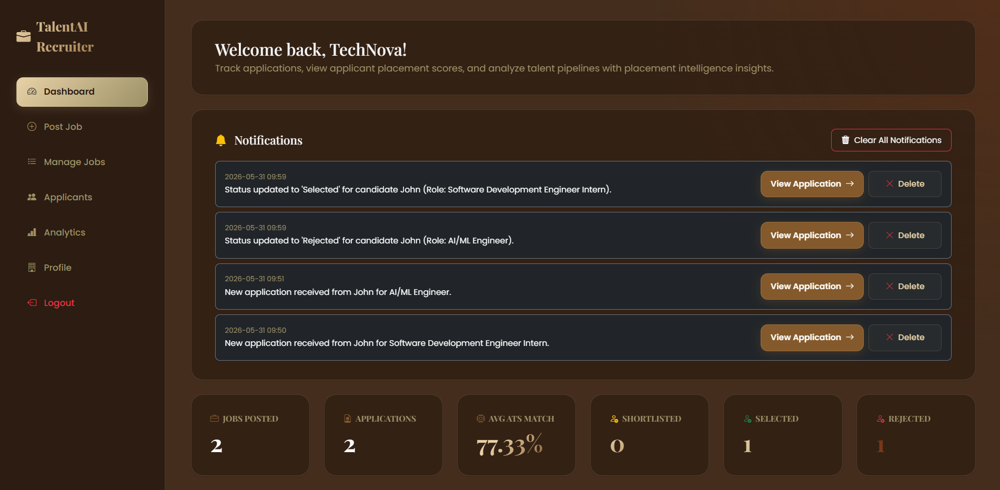

# TalentAI: AI-Enabled Placement Support and Interview Guidance System

## Overview

TalentAI is a comprehensive web-based platform designed to help students prepare for placements and assist recruiters in managing hiring activities efficiently. The system combines resume analysis, ATS evaluation, interview preparation, job management, career guidance, and analytics into a single application.

The goal of TalentAI is to bridge the gap between student readiness and industry expectations by providing intelligent feedback, personalized preparation resources, and data-driven insights.

---

## Key Features

### Student Module

* Student registration and authentication
* Student dashboard with performance insights
* Resume upload and management
* Job browsing and application tracking
* Profile management
* Placement readiness tracking

### Recruiter Module

* Recruiter registration and authentication
* Recruiter dashboard
* Job creation and management
* Applicant tracking
* Candidate profile review
* Recruitment workflow support

### Resume Analysis & ATS Evaluation

* ATS score calculation
* Resume feedback generation
* Resume and Job Description matching
* Keyword analysis
* Resume improvement suggestions

### Interview Preparation

* HR interview question generation
* Technical interview question generation
* Interview response evaluation
* Interview feedback generation
* Interview history tracking

### Coding Preparation

* Topic-wise coding preparation
* Categorized interview questions
* Practice resources for technical rounds

### Career Guidance

* Career recommendation engine
* Learning roadmap generation
* Skill development suggestions

### Analytics Dashboard

* Placement readiness analytics
* Resume performance analytics
* Interview performance insights
* Student progress tracking

---

## Technology Stack

### Backend

* Python
* Flask
* SQLAlchemy
* Flask-Login

### Frontend

* HTML
* CSS
* JavaScript

### Database

* SQLite

### AI Components

* ATS Evaluation Engine
* Resume Feedback Engine
* Job Description Generator
* HR Interview Question Generator
* Technical Interview Question Generator
* Technical Answer Evaluator
* Career Recommendation Engine
* Learning Roadmap Generator
* Analytics Engine

---

## Screenshots

### Home Page



### Student Dashboard



### Available Jobs



### ATS Score Analysis



### Resume Comparison



### Technical Interview Module



### Interview Feedback



### Analytics Dashboard



### Recruiter Dashboard



---

## System Architecture

The application follows a modular Flask architecture to ensure scalability and maintainability.

### Core Components

* Student Management Module
* Recruiter Management Module
* Resume Analysis Module
* ATS Scoring Engine
* Interview Preparation Module
* Coding Preparation Module
* Career Guidance Module
* Analytics Module
* Database Layer

---

## Project Structure

```text
placement_support_system/

├── ai_modules/
│   ├── analytics_engine.py
│   ├── ats_engine.py
│   ├── career_recommender.py
│   ├── coding_prep_engine.py
│   ├── embedding_engine.py
│   ├── hr_answer_evaluator.py
│   ├── hr_question_generator.py
│   ├── jd_generator.py
│   ├── resume_feedback.py
│   ├── roadmap_generator.py
│   ├── technical_evaluator.py
│   └── technical_question_generator.py
│
├── models/
├── routes/
├── static/
├── templates/
├── utils/
│
├── assets/
│   └── screenshots/
│
├── app.py
├── config.py
├── requirements.txt
├── seed_data.py
├── run_migrations.py
└── README.md
```

---

## Installation

### Clone Repository

```bash
git clone https://github.com/Akshita268/talent-ai-placement-support-system.git
```

### Navigate to Project

```bash
cd placement_support_system
```

### Create Virtual Environment

```bash
python -m venv venv
```

### Activate Virtual Environment

Windows:

```bash
venv\Scripts\activate
```

### Install Dependencies

```bash
pip install -r requirements.txt
```

### Run Application

```bash
python app.py
```

The application will start at:

```text
http://127.0.0.1:5000
```

---

## Current Functionalities

* Student Registration and Login
* Recruiter Registration and Login
* Resume Upload and Analysis
* ATS Score Evaluation
* Resume Feedback Generation
* Resume and JD Matching
* Job Posting and Management
* Job Application Tracking
* HR Interview Preparation
* Technical Interview Preparation
* Coding Preparation Module
* Career Recommendation Engine
* Learning Roadmap Generator
* Analytics Dashboard
* Performance Tracking

---

## Project Scope

* Multi-module Flask application
* Role-based access control
* AI-assisted placement preparation
* Resume intelligence and ATS analysis
* Recruitment workflow management
* Interview preparation ecosystem
* Student performance analytics
* Scalable modular architecture

---

## Future Enhancements

* Large Language Model (LLM) Integration
* Retrieval-Augmented Generation (RAG)
* Real-Time Interview Simulation
* AI-Powered Resume Builder
* Advanced Skill Gap Analysis
* Personalized Learning Paths
* Placement Prediction Models
* Cloud Deployment and Scalability Improvements

---

## Motivation

The project was developed to address common challenges faced by students during placement preparation. By combining resume evaluation, interview preparation, career guidance, and analytics into a unified platform, TalentAI aims to help students improve their employability while providing recruiters with efficient tools for managing candidates and job opportunities.

---

## Author

**Akshita**

Computer Science Engineering Student

---

## License

This project is intended for educational, learning, and demonstration purposes.
